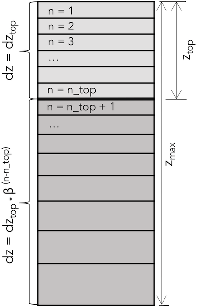

# Using GEMB

The simplest example of how to use GEMB can be found in `MASTER_RUN.m`, which loads some local climate data, defines some constants, and enters all of that into the `GEMB` function. The dependency graph above shows that `GEMB` calls several other functions that each model a given process such as accumulation, densification, melt, shortwave radiation. etc.

# Function List 

**`GEMB`** is the main function in this package. 

**`accumulation`** adds precipitation and deposition to the model grid.

**`albedo`** calculates snow, firn, and ice albedo.

**`combineStrucData_GEMB`** combines GEMB input data into structure for passing to parfor loop. 

**`densification`** computes the densification of snow/firn using the emperical model of [*Herron and Langway* (1980)](doi.org/10.3189/S0022143000015239) or the semi-emperical model of [*Anthern et al*. (2010)](https://doi.org/10.1029/2009JF001306).

**`gardnerAlb`** models a broadband albedo parameterization described in [*Gardner & Sharp*, 2010](doi.org/10.1029/2009jf001444). 

**`grainGrowth`** models the effective snow grain size.

[**`gridInitialize`**](gridInitialize_documentation.md) sets up the initial layer thickness and total grid depth.  

**`managelayers`** adjusts the depth and number of vertical layers in the model to ensure that the thickness of any single layer does not exceed thresholds set for the minimum and maximum allowable layer thickness. 

**`melt`** computes the quantity of meltwater due to snow temperature in excess of 0 deg C, determines pore water content and adjusts grid spacing.

**`plotgemb`** plots GEMB output.

**`shortwave`** distributes absorbed shortwave radiation vertically within snow/ice.

**`thermo`** computes new temperature profile accounting for energy absorption and thermal diffusion.

# Output Data 

GEMB output, value summed per output timestep. For values with layers, above the surface is padded with NaN, e.g., to get the full layer of densities for time step 1: `density_column=d(end-m+1:end,1);` and the surface density at time step 1 (or d1(1) ) should be equal to `density_column(1)`.

* EC: surface evaporation (-) condensation (+) [kg m-2]
* F: refreeze within column [kg m-2]
* FAC: firn air content within column [m]
* M: melt of column [kg m-2]
* P: precipitation input [kg m-2]
* R: runoff of column [kg m-2]
* Ra: rain added to column [kg m-2]
* S: structure of all model input
* T: temperature of each layer [K]
* Ta: 2m air temperature input [K]
* W: liquid water content of each layer [kg m-2]
* a1: albedo of the top layer [fraction]
* comp1: dry snow ccompaction [m]
* comp2: melt compaction [m]
* d: density of each layer [kg m-3]
* d1: density of the top layer [kg m-3]
* dz: layer depths [m]
* gdn: grain dendricity within each layer
* gsp: grain sphericity within each layer
* lhf: latent heat flux [W m-2]
* m: number of snow layers
* mAdd: mass added/removed to/from base of model [kg m-2]
* netLW: net longwave radiation between atmosphere and top layer [W m-2]
* netQ: net energy between atmosphere and top layer (netSW + netLW + shf + lhf) [W m-2]
* netSW: net shortwave radiation between atmosphere and top layer [W m-2]
* ps: pore space within each layer [m^3/m^2]
* re: optically equivelant grain radius within each layer [mm]
* re1: optically equivelant grain radius of the top layer [mm]
* shf: sensible heat flux between atmosphere and top layer [W m-2]
* time: time since beginning of simulation [day]
* ulw: upward longwave radiation between atmosphere and top layer [W m-2]

# Basic theory
GEMB is a vertical 1-D column model, i.e., no horizontal communication between model nodes, that simulates atmosphere–surface mass and energy exchanges and the internal evolution of snow, firn, and ice. The model shares many characteristics with earlier published firn models that also simulate atmosphere–surface exchanges (e.g., *Bassford*, 2002; *Bougamont and Bamber*, 2005; *Greuell and Konzelmann*, 1994). The model is a finite-difference model with tens to hundreds of layers, the thickness of which is managed dynamically. It is forced at its surface with near-surface (2–10 m) estimates of precipitation, air temperature, wind speed, vapor pressure, surface pressure, downwelling longwave and shortwave radiation fluxes, and optional inputs of solar zenith angle, cloud optical thickness, and bare ice albedo. At its bottom boundary, the model applies a constant thermal flux. Internally, the model simulates thermal diffusion, shortwave subsurface penetration, meltwater retention, percolation and refreeze, effective snow grain size, dendricity, sphericity, and compaction. The model does not yet account for changes in firn due to horizontal advection or ice divergence (*Horlings et al.*, 2021). GEMB also does not account for changes in thermal properties caused by debris cover that are important for the modeling of valley glaciers. In this section we detail specific implementation of various processes and their options within the model.

The diagram above shows how the initial grid is created by the `gridInitialize` function, with a top layer whose cells are equally spaced, and a bottom layer whose cells grow larger with depth. 

